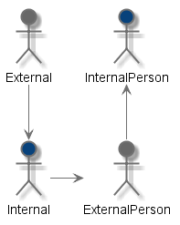
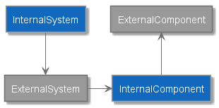

# C4-PlantumlSkin
Some skinning to create C4 diagrams

## Prerequisites
---

Before you start, you need to be familiar at minimum with:

- [PlantUml](http://plantuml.com/index)
- [C4 model](https://c4model.com/)

First of all you need to have plantuml up and running. For this you have multiple options (all of which will work with this):

1. [Local installation](http://plantuml.com/starting)
1. [Free online editor](https://www.planttext.com/)
1. [VisualStudio Code Plugin](https://github.com/qjebbs/vscode-plantuml): This plugin allows you to "embed" diagrams in your markdown files, which is the best of all worlds in my opinion, and is hence really recommended.

Once you have something running (or just went to planttext online editor), you can start using plantuml to create text-driven models and diagrams.

## Brief description
---

This project will help you use the awesome plantuml tool to create C4 diagrams for documenting architecture.

C4 defines a set of diagrams (core and supplamentary) that are designed to document architecture in a way that is easy to understand and communicate.

PlantUml is a uniquely pleasant-to-use tool to create diagrams from text. The fact that this is a text-driven tool opens up a lot of previously impossible scenarios:

1. It is a *pleasure* to edit
1. You don't need special tooling
1. You can keep your domain models side-by-side with your code
1. You can embedd models in your markdown documents in almost all major editors
1. Did I mention that it is an absolute pleasure to work with plantuml?

The only real disadvantage to plantuml is that positioning can sometimes be a bit hard.

This tool allows you to use stereotypes to skin your diagram to be close to what is standard with C4. You can use this include to skin the following diagrams:

1. System Context diagram
1. Container diagram
1. Component diagram
1. System Landscape diagram
1. Dynamic diagram
1. Dynamic diagram


## Instructions
---

All that is needed to start is to add the following line:
```plantumlcode
!includeurl https://raw.githubusercontent.com/skleanthous/C4-PlantumlSkin/master/build/output/c4.puml
```

> **NOTE**: This will set your diagram type as a deployment diagram. If you want to add some incompatible artifacts in your diagram, please also add the following statement below the `includeurl` one
> ```plantumlcode
> allowmixing
> ```

1. ### Stereotypes and legend

    As mentioned above, the way that you would skin your artifacts is through the use of stereotyping. Due to this, currently stereotype names are not emitted, but instead, a legend is emited on the bottom right. At this time it cannot be turned off.

1. ### PlantUml Actors <--> C4 Person

    There is support for two types of actors. Internal and external actors. The supported stereotypes are:
    - `<<Internal>>`
    - `<<External>>`
    
    The following code:

    ```plantumlcode
    @startuml
    !define NO_LEGEND

    !includeurl https://raw.githubusercontent.com/skleanthous/C4-PlantumlSkin/master/build/output/c4.puml

    actor Internal <<Internal>>
    actor External <<External>>
    actor InternalPerson <<Internal Person>>
    actor ExternalPerson <<External Person>>

    External -down-> Internal
    Internal -right-> ExternalPerson
    ExternalPerson -up-> InternalPerson

    @end
    ```

    Produces this outcome:

    

1. ### PlantUml Components <--> C4 Containers

    PlantUml components can represent containers (and not C4 components which is a bit confusing), which are useful to be shown normally on `System Context`, `Container` and `System Landscape` diagrams. The supported stereotypes are:
    
    - `<<Internal Container>>`
    - `<<External Container>>`

    
    The following code:

    ```plantumlcode
    @startuml
    !define NO_LEGEND

    !includeurl https://raw.githubusercontent.com/skleanthous/C4-PlantumlSkin/master/build/output/c4.puml

    component Internal <<Internal Container>>
    component External <<External Container>>

    Internal -right-> External

    @end    
    ```

    Produces this outcome:

    

2. ## PlantUml Rectangles <--> C4 Systems and C4 Components

    PlantUml rectangles can represent C4 systems and components. The supported stereotypes are:

    - `<<Internal System>>`
    - `<<Internal Component>>`
    - `<<External System>>`
    - `<<External Component>>`

    Systems and Components render the same way (as rectangles) skinned only to render correctly according to whether they are internal or external.

    The following code:

    ```plantumlcode
    @startuml
    !define NO_LEGEND

    !includeurl https://raw.githubusercontent.com/skleanthous/C4-PlantumlSkin/master/build/output/c4.puml

    rectangle InternalSystem <<Internal System>>
    rectangle ExternalSystem <<External System>>
    rectangle InternalComponent <<Internal Component>>
    rectangle ExternalComponent <<External Component>>

    InternalSystem -down-> ExternalSystem
    ExternalSystem -right-> InternalComponent
    InternalComponent -up-> ExternalComponent

    @end
    ```

    Produces this outcome:

    

## Inspiration \ Acknowledgements
---

Basically the only acknowledgement is [C4-PlantUML](https://github.com/RicardoNiepel/C4-PlantUML) from [Ricardo Niepel](https://github.com/RicardoNiepel). This is a very good library to work with C4, but I wanted something much more native to plantuml. Specifically I wanted to be able to work with artifacts native to plantuml (`rectangle`, `queue`, `component`, etc.) instead of the "method"-like means that this library exposes.